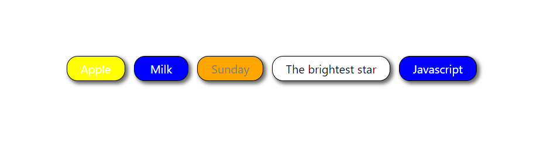

# react-pills-component

react-pills-component lets you create a pill or capsule from a provided list.You select/deselect pills and use props to style your pills.



## Installation

```bash
npm install --save react-pills-component

```

## Usage

```python
import Pills from "react-pills-component";

   const data = [
       {
        text: "Apple",
        id: "1",
        pillColor: "yellow",
        selected: false,
        selectedPillColor: "blue",
      },
      {
        text: "Milk",
        id: "2",
        pillColor: "blue",
        selected: false,
        selectedPillColor: "yellow",
      },
      {
        text: "Sunday",
        id: "3",
        pillColor: "orange",
        selected: false,
        selectedPillColor: "white",
      },
      {
        text: "The brightest star",
        id: "4",
        pillColor: "white",
        selected: false,
        selectedPillColor: "blue",
      },
      {
        text: "Javascript",
        id: "5",
        pillColor: "red",
        selected: false,
        selectedPillColor: "blue",
      }
    ],

   <Pills itemList={data} selectedPill={this.selectedData} />
```

## Inputs to pass and Props

| Input/Props | Name                         | Mandatory | Type       | Description                                                                                              |
| :---------- | :--------------------------- | :-------- | :--------- | :------------------------------------------------------------------------------------------------------- |
| `Input`     | `itemList`                   | `yes`     | `array`    | Array of objects which will contain information about pill text and styles to be be applied.             |
| `Input`     | `itemList.text`              | `yes`     | `string`   | Text to be displayed inside the pill.                                                                    |
| `Input`     | `itemList.id`                | `yes`     | `string`   | A unique string which will be associated with the pill.                                                  |
| `Input`     | `itemList.selected`          | `yes`     | `boolean`  | Boolean value used to identify if a pill is selected or not.                                             |
| `Input`     | `itemList.pillColor`         | `no`      | `string`   | Background color for the pill.Default color is azure.                                                    |
| `Input`     | `itemList.selectedPillColor` | `no`      | `string`   | Background color for the pill when a pill is selected(itemList.selected = true).Default color is violet. |
| `Props`     | `selectedPill`               | `yes`     | `function` | Function that will give back the selected value.                                                         |

---

## License

MIT
